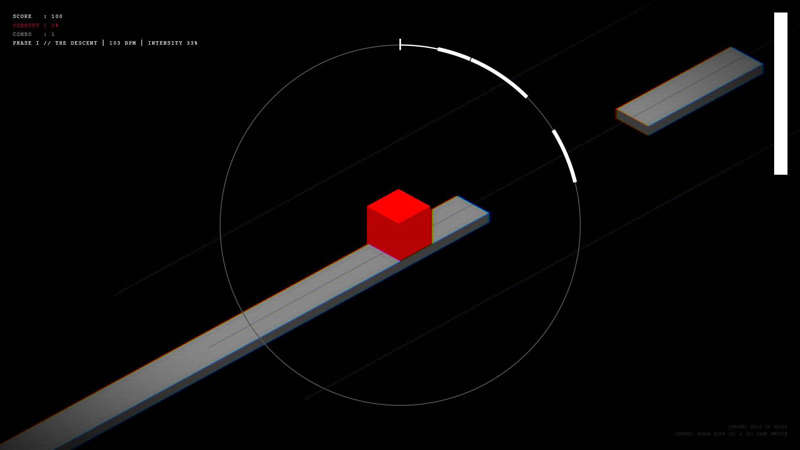
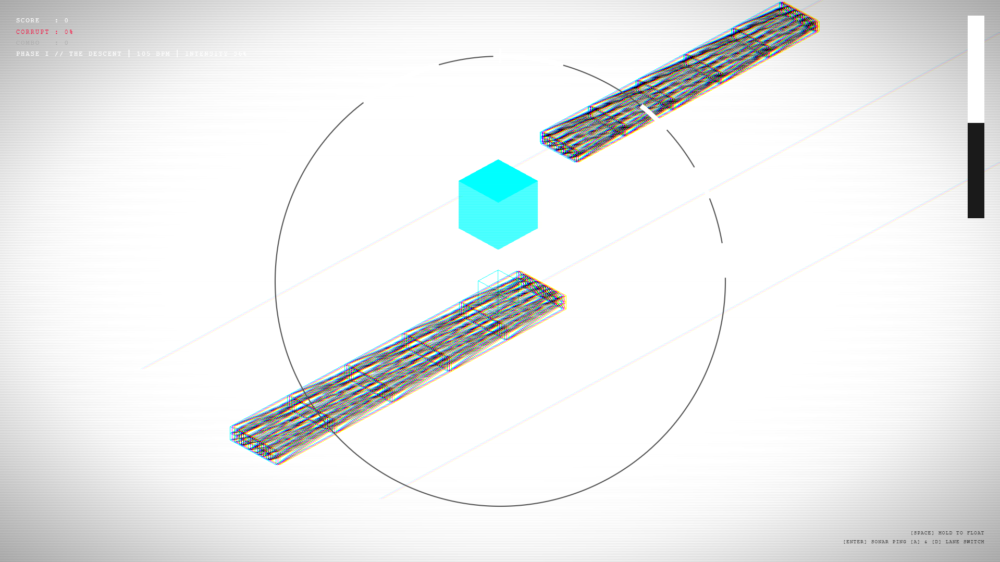
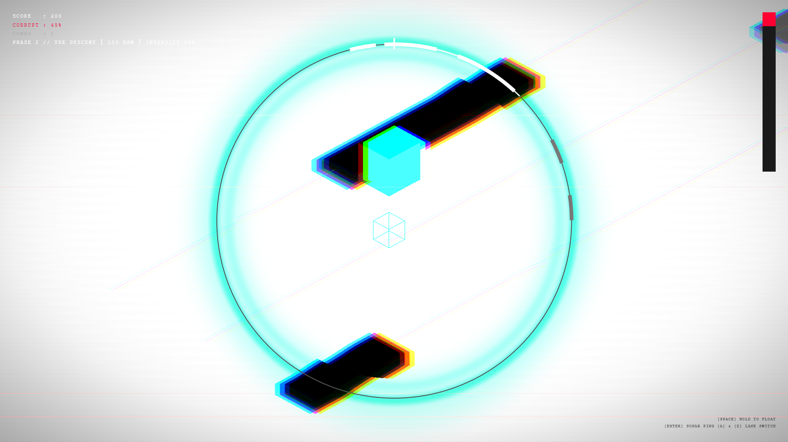
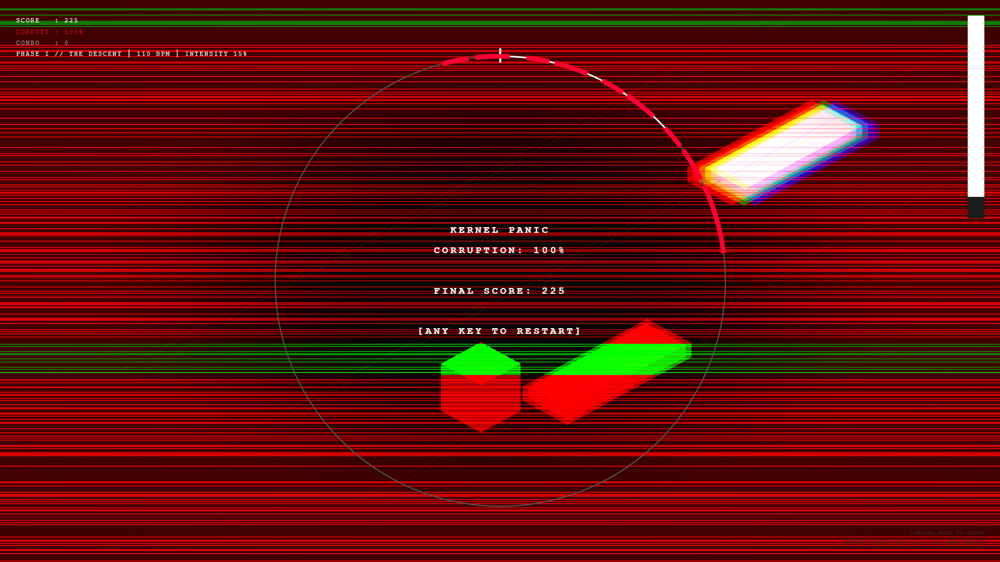

# AXIOMATIQUE

rhythm-based survival platformer · 3d isometric · made in 24h without sleep \
no game engine · no external assets · 100% procedural generation \
best art prize in Beykent University BETA Game Jam II, 2026 \

**[Play →](https://deuspoeticus.github.io/axiomatique)** \
**[See on itch.io →](https://deuspoeticus.itch.io/axiomatique)**

---



---

## Concept

Platform patterns are entirely driven by sound, practically functioning as a music notation system. Three lanes represent three different frequency bands — **BASS**, **MID**, and **HIGH** — and the level geometry is derived from the same procedural engine that generates the music. Levels and music share the same foundational axioms.

---

## Controls

| Input | Action |
|---|---|
| `SPACE` (hold) | Hovering |
| `ENTER` | Sonar signal |
| `A` / `D` | Lane switch |

---

## Screenshots



*Hovering: the scene inverts, platforms lose their resolved state and enter quantum superposition (wireframe jitter). Decoys become indistinguishable from nodes.*



*Sonar ping: fires a radial ring that reveals platform types on contact — at the cost of corruption.*



*Kernel panic: corruption reaches 100%. The system fails.*

---

## Tech

- **Three.js** WebGL scene, instanced mesh rendering, isometric orthographic camera
- **Web Audio API** fully procedural hard techno / dubstep synthesiser; zero external assets
- **Vite** build tooling and dev server

---

## Architecture

```
src/
├── main.js                   — bootstrap, AudioContext gate
├── constants.js              — all tunable parameters
├── audio/
│   ├── MusicEngine.js        — procedural synth: kick, Reese bass, snare, hats, stabs, leads
│   └── Synth.js              — facade over MusicEngine for game systems
├── engine/
│   ├── Renderer.js           — WebGL renderer, post-processing chain
│   └── shaders/
│       └── PostShader.js     — GLSL: inversion, sonar ring, scanlines, chromatic aberration,
│                               bloom, vignette, corruption glitch, kernel panic death screen
├── game/
│   ├── GameLoop.js           — rAF loop, beat clock, collision, scoring, sonar
│   ├── Player.js             — state machine: GROUNDED / HOVERING / FALLING
│   └── PhaseManager.js       — phase transitions: DESCENT → DESYNC → PERFECT LOOP
├── pool/
│   └── BlockPool.js          — instanced mesh pool (256 slots/type), quantum superposition mode
├── track/
│   ├── TrackEngine.js        — platform spawning, BPM-scaled speed
│   ├── LevelGenerator.js     — music-driven procedural level generation
│   └── LaneGuides.js         — static lane runway geometry
└── ui/
    └── Compass.js            — canvas 2D ring compass, platform arc timing display
```

### Frequency → Lane mapping

| Lane | Frequency band | Platform character |
|---|---|---|
| `BASS` (−1) | Sub-bass · Reese · Kick | Long, slow |
| `MID` (0) | Kick · Snare · Stabs | Regular |
| `HIGH` (+1) | Hats · Noise bursts | Short, fast |

### Audio engine

The synth runs a 16-step scheduler at 16th-note resolution. BPM ramps from **100 → 200** across the session. Intensity (0 → 1) drives both layer entry thresholds and level difficulty in lockstep. All audio is synthesised in real time — zero samples, zero external files.

### Post-processing pipeline

`RenderPass → ShaderPass (PostShader)`

Effects active simultaneously: chromatic aberration · scanlines · fake bloom · vignette · sonar ripple distortion · hover inversion · corruption glitch lines · kernel panic death screen.

---

## Development

```bash
npm install
npm run dev      # dev server at localhost:1420
npm run build    # outputs to dist/
npm run preview  # preview the production build
```

---

## Deployment

The GitHub Actions workflow (`.github/workflows/deploy.yml`) builds the project and deploys `dist/` to GitHub Pages automatically on every push to `main`.

> If serving from a project repo (`github.com/you/axiomatique`), keep `base: '/axiomatique/'` in `vite.config.js`.  
> If using a root domain repo (`you.github.io`), set `base: './'`.

---

```
DEVSPOETICVS · ENFANTDUSIÈCLE · 2026
```
